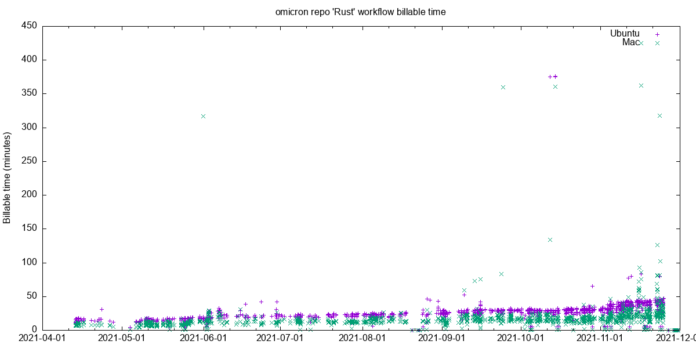

# gh-workflow-runs

This is a very simple tool to dump out basic information about workflow runs for
a GitHub repo.  The structure is based on
[gh-subscriptions](https://github.com/davepacheco/gh-subscriptions) -- follow
the instructions there to set up this tool (i.e., create a personal access
token, etc.)

## The data

The data here was collected with something like:

```
./gh-workflow-runs | tee data/all_runs_raw.out
```

The raw output was filtered and summarized with:

```
grep '^{' data/all_runs_raw.out | json -ga created_at timing_billable.UBUNTU timing_billable.MACOS head_branch | awk 'NF == 4' > data/summary.out
```

The graph is generated with:

```
gnuplot < summary.gnuplot > data/summary.png
```

The result:


